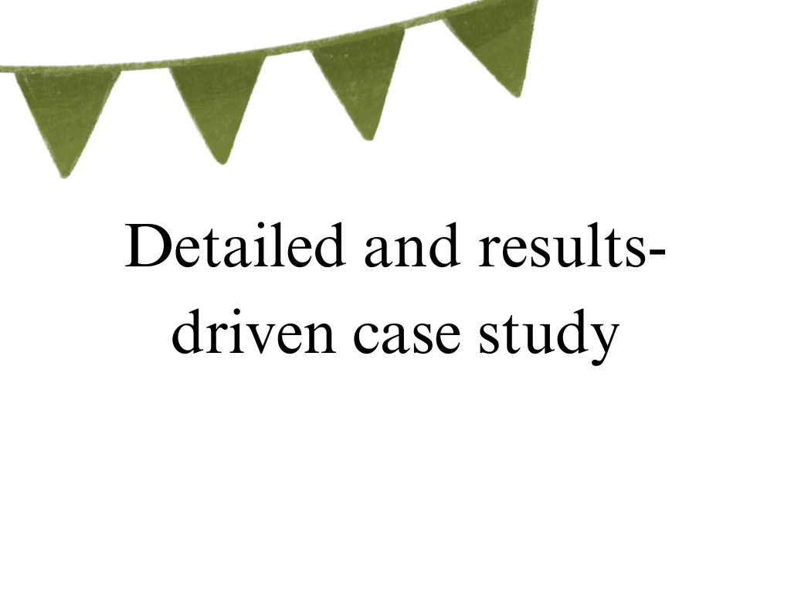
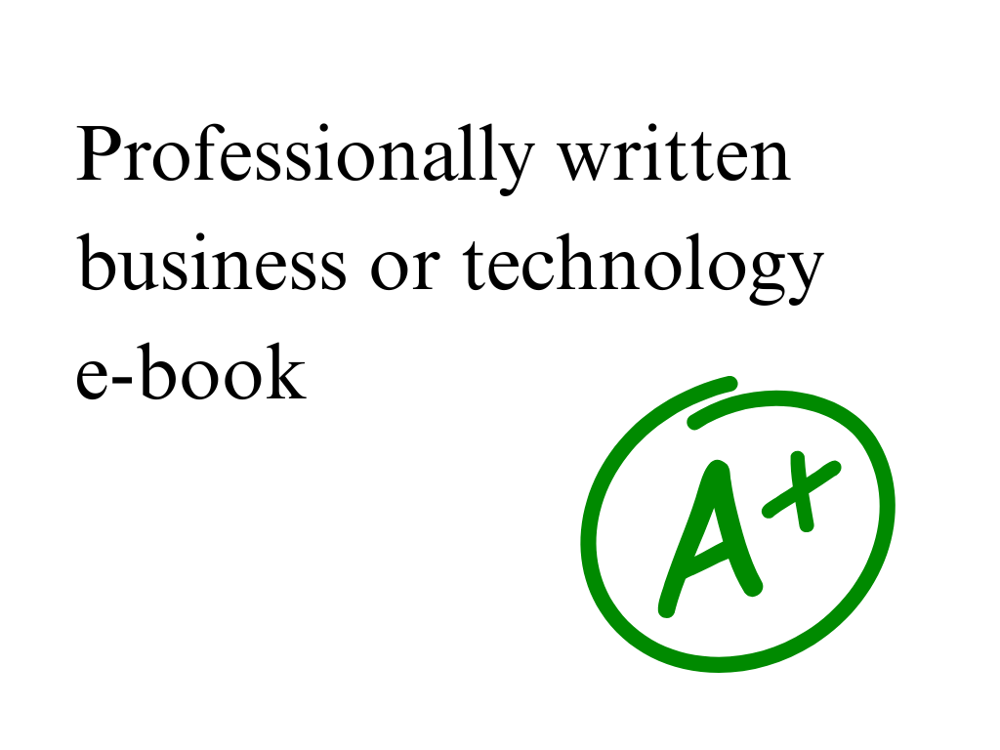
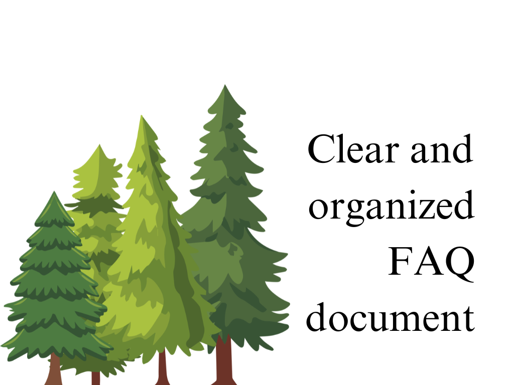
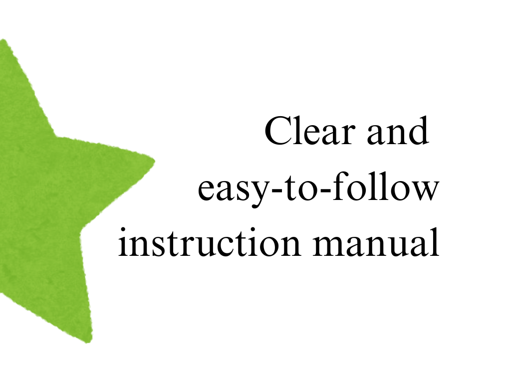
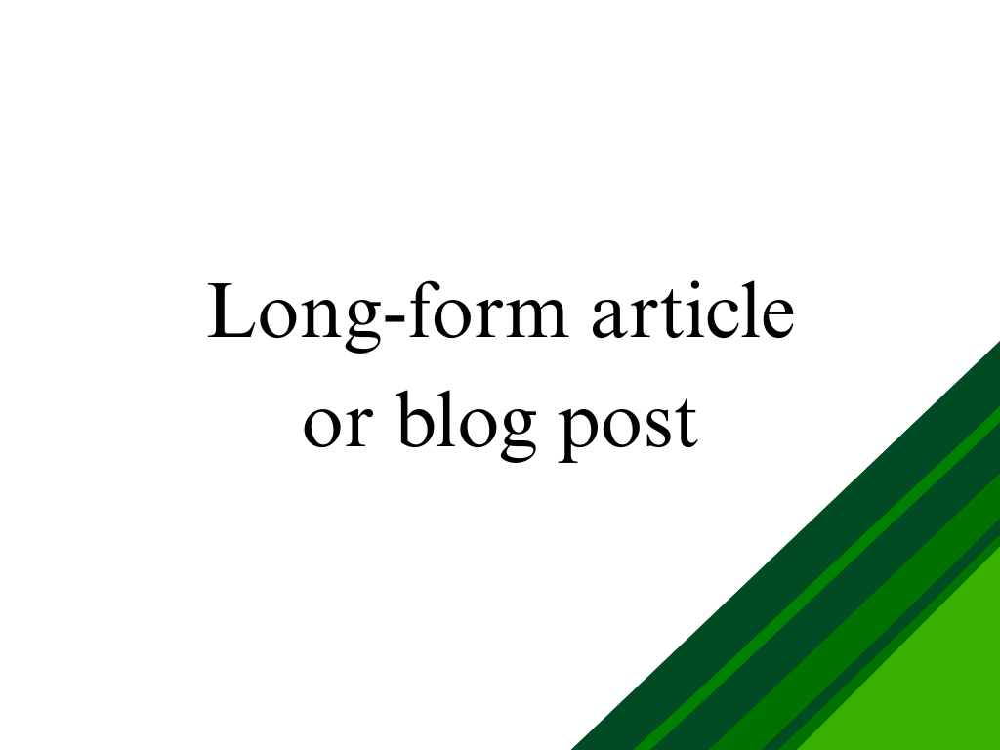
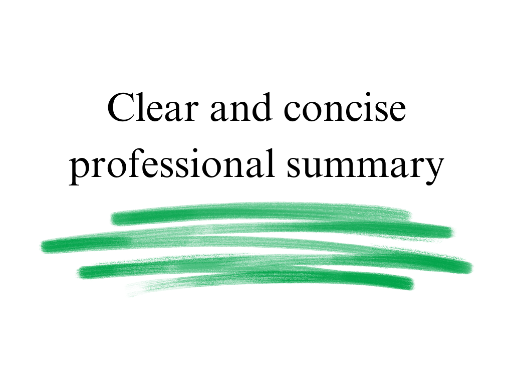
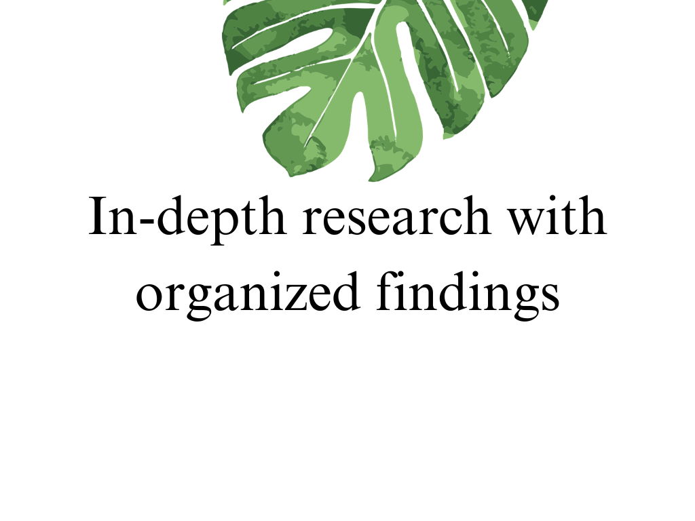
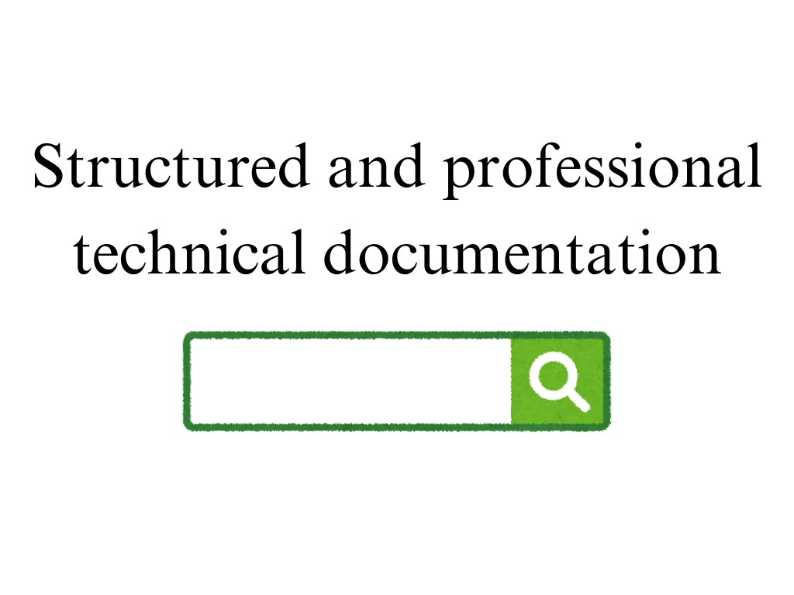
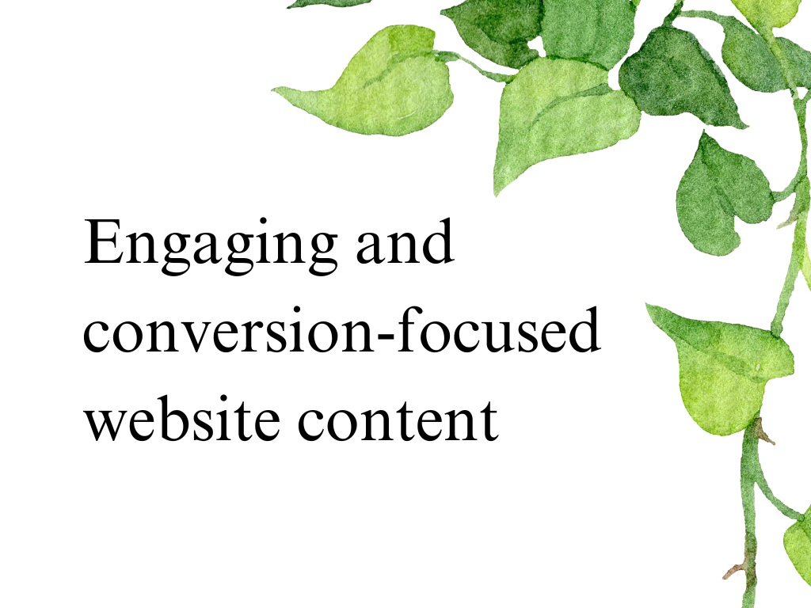
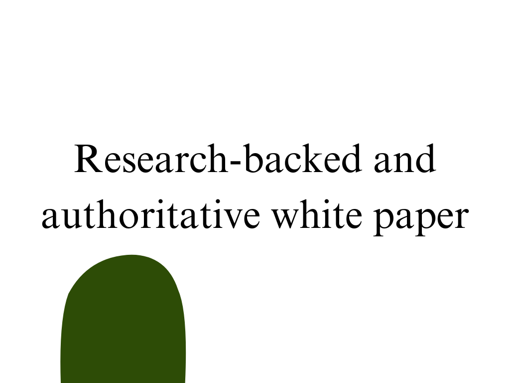

## Technical Writing, Research, and Strategy

- [Case study](#case-study)
- [Ebook](#ebook)
- [FAQ document](#faq-document)
- [Instructional manual](#instructional-manual)
- [Long-form article](#long-form-article)
- [Professional summary](#professional-summary)
- [Research](#research)
- [Technical documentation](#technical-documentation)
- [Technical report](#technical-report)
- [Website content](#website-content)
- [White paper](#white-paper)

 

---

### Case study

Case studies built on structured interviews, outcome analysis, and persuasive storytelling.

Each study highlights measurable results, showcases problem-solving, and demonstrates business or technical impact, designed to boost credibility, attract clients, and drive decision-making.

[↑ Back to top](#technical-writing-research-and-strategy)

---

### Ebook

Ebooks created through deep research, logical framework design, and professional narrative structuring.

Tailored for executives, startups, or tech leaders, these publications educate audiences, build credibility, generate leads, and position you as an authority in your field.

[↑ Back to top](#technical-writing-research-and-strategy)

---

### FAQ document

Strategically designed FAQs based on audience intent mapping, key pain points, and clarity-focused messaging.

Built to reduce support inquiries, educate users, and reinforce credibility while guiding audiences toward desired actions or decisions.

[↑ Back to top](#technical-writing-research-and-strategy)

---

### Instructional manual

User-focused manuals created through process mapping, logical task sequencing, and clear language.

Designed for usability and efficiency, these manuals reduce errors, improve adoption, and provide a professional, authoritative guide for any technical, business, or operational system.

[↑ Back to top](#technical-writing-research-and-strategy)

---

### Long-form article

Comprehensive long-form content developed through structured outlining, in-depth research, and expert synthesis.

Each article is crafted for clarity, SEO alignment, and thought-leadership impact, ensuring readers gain actionable insights while elevating your authority in business, tech, and green innovation sectors.

[↑ Back to top](#technical-writing-research-and-strategy)

---

### Professional summary

Concise executive summaries distilling complex research, reports, or technical materials into actionable insights.

Structured for clarity and brevity, these summaries help decision-makers quickly grasp critical points without losing nuance or precision.

[↑ Back to top](#technical-writing-research-and-strategy)

---

### Research

Strategically structured research synthesizing verified sources, industry trends, and actionable insights.

Delivered in a clear, concise format to support executive decisions, product development, marketing strategies, and evidence-based business planning with confidence.

[↑ Back to top](#technical-writing-research-and-strategy)

---

### Technical documentation

Technical content developed to translate complex systems into precise, structured, and accessible documents.

Designed for engineers, product teams, or end users, these documents combine accuracy with clarity to support operations, troubleshooting, and technical adoption.

[↑ Back to top](#technical-writing-research-and-strategy)

---

### Technical report

Analytical technical reports developed through structured data evaluation, evidence-based conclusions, and clear professional presentation.

Designed to inform strategy, support decision-making, and provide authoritative insights in technical, environmental, or business contexts.

[↑ Back to top](#technical-writing-research-and-strategy)

---

### Website content

Website copy developed with audience research, strategic positioning, and clear value articulation.

Designed to communicate authority, guide visitors through the buyer journey, and enhance brand credibility while supporting measurable conversion goals.

[↑ Back to top](#technical-writing-research-and-strategy)

---

### White paper

Research-driven white papers crafted with data synthesis, strategic messaging, and authoritative narrative.

Designed to educate decision-makers, demonstrate thought leadership, support sales cycles, and position brands as trusted authorities in technology, business, or environmental innovation.

[↑ Back to top](#technical-writing-research-and-strategy)

---
